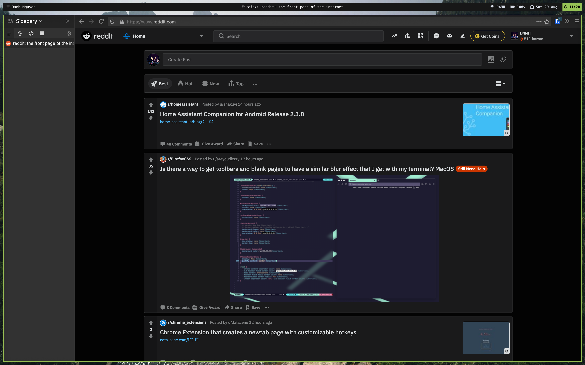
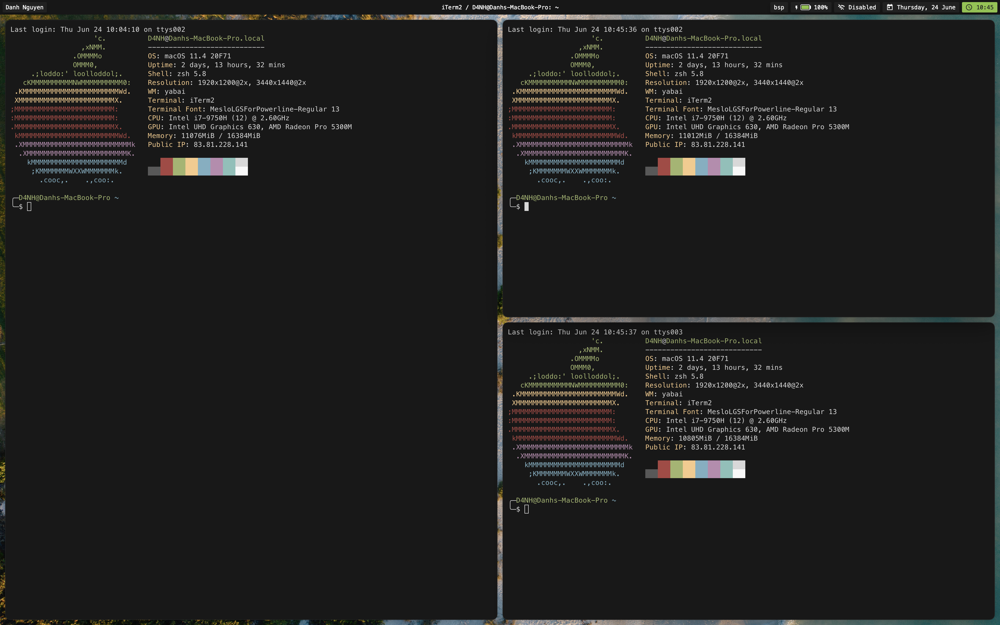

# D4NH's dotfiles

* OS: `macOS Big Sur 11.4`
* Window Manager: `yabai`
* Terminal: `iTerm`
* Terminal color scheme: `base16-shell`
* Text Editor: `Visual Studio Code`
* Font: `MesloLGSForPowerline-Regular`
* Web Browser: `Mozilla Firefox`

## Screenshots

## Links

* [yabai](https://github.com/koekeishiya/yabai)
* [iTerm](https://www.iterm2.com/)
* [fonts](https://github.com/powerline/fonts)
* [base16-cs](https://github.com/chriskempson/base16)
* [ubersicht](http://tracesof.net/uebersicht/)

