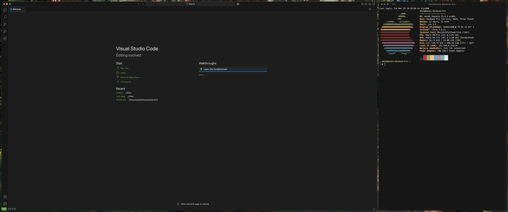

# D4NH's dotfiles

- Device: `Macbook Pro M4 Pro, 24GB, 512GB`
- OS: `macOS Sequoia 15.3.2`
- Window Manager: `yabai`
- Terminal: `iTerm`
- Terminal color scheme: `base16-shell`
- Text Editor: `VS Code`
- Font: `MesloLGSForPowerline-Regular`
- Web Browser: `Mozilla Firefox`

## Screenshots

## Links

- [yabai](https://github.com/koekeishiya/yabai)
- [iTerm](https://www.iterm2.com/)
- [fonts](https://github.com/powerline/fonts)
- [base16-default-dark](https://github.com/tinted-theming/home)
- [ubersicht](http://tracesof.net/uebersicht/)
